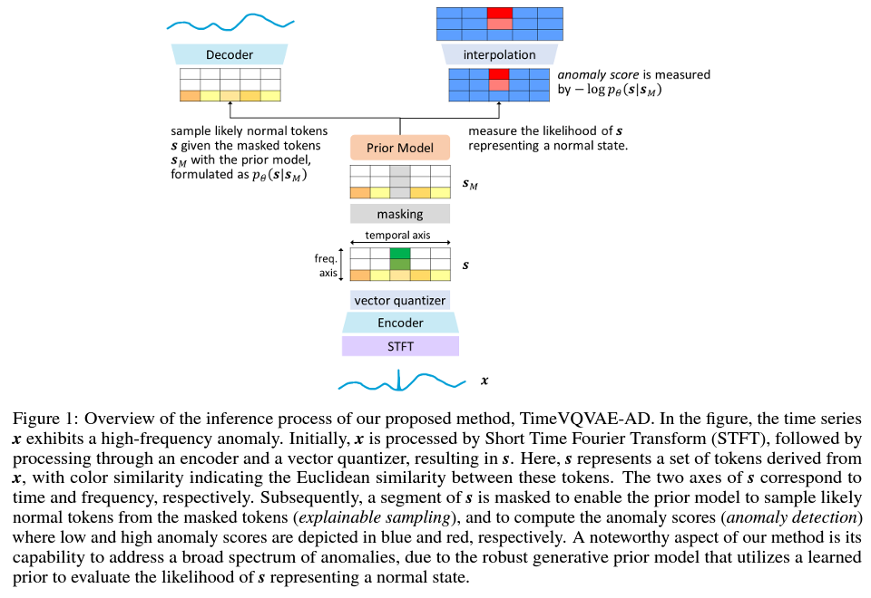
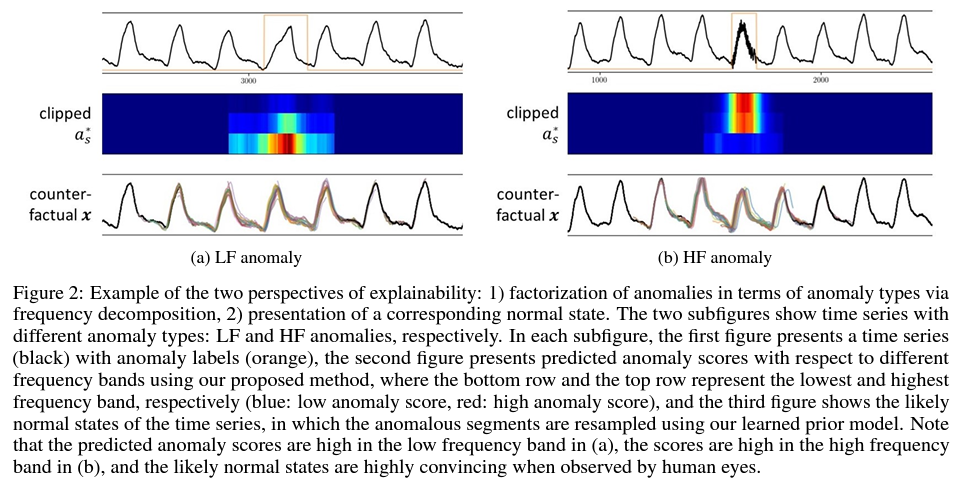
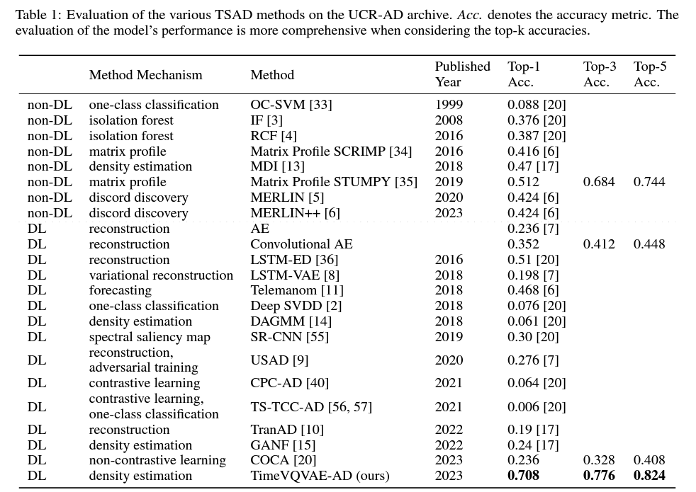

# TimeVQVAE-AD

This is an official GitHub repository for the PyTorch implementation of TimeVQVAE from our paper, ["Explainable time series anomaly detection using masked latent generative modeling." Pattern Recognition (2024)](https://arxiv.org/abs/2311.12550).

TimeVQVAE-AD is a novel time series anomaly detection method, notable for its high accuracy and superior explainability. It builds on TimeVQVAE [1], using masked generative modeling for time-frequency domain analysis. This approach preserves dimensional semantics in the latent space, enabling precise anomaly score computation across different frequency bands. TimeVQVAE-AD also generates counterfactuals, enhancing explainability by presenting likely normal states for detected anomalies. Its effectiveness is demonstrated on the UCR Time Series Anomaly archive, significnatly outperforming existing methods in both detection accuracy and explainability.

<p align="center">

</p>

<p align="center">

</p>

<p align="center">

</p>

## Prerequisite

### Environmental Setup
The necessary libraries can be intalled by
```
pip install -r requirements.txt
```

### Dataset Preparation

1. Download the dataset zip file [here](https://figshare.com/articles/dataset/UCR_Time_Series_Anomaly_Detection_datasets_2021_/26410744).
    - the zip file contains `AnomalyDatasets_2021`. 
2. Place `AnomalyDatasets_2021` in `preprocessing/dataset/`.
    - now, you should have `preprocessing/dataset/AnomalyDatasets_2021/`.


## Usage

### Configuration
`configs/config.yaml` allows configuring various (hyper-)parameters for data processing, training, model settings, etc.

### Training: Stage1
```
python stage1.py --dataset_ind 1
```

### Training: Stage2
```
python stage2.py --dataset_ind 1
```

### Evaluation
```
python evaluate.py --dataset_ind 4
```
This performs anomaly detection on a test set of a target dataset using pretrained models from stage 1 and 2. 
The results are stored in `evaluation/results/`:
* Visualizations: `{dataset_idx}-anomaly_score-latent_window_size_rate_{..}.png` for the predicted anomaly scores with a certain latent window size rate $r_w$ and `{dataset_idx}-joint_anomaly_score-acc_{top-1-acc,top-3-acc,top-5-acc}.png` for the aggregated anomaly score, including $a_\text{final}$.
* Resulting data: `{dataset_idx}-anomaly_score-latent_window_size_rate_{..}.pkl` and `{dataset_idx}-joint_anomaly_score.pkl`. The jupyter notebook, `.released_results/how_to_plot_anomaly_scores_using_resulting_data.ipynb` provides a tutorial for handling the pkl data.


## Our Results are Publicly Available
For details, see `.released_results/README.md`.


## Update Notes

### Implementation Modifications
- [2024.07.26] use the memory-efficient $E$ and $D$ with incremental hidden dimension size for depths; the Snake activation [2] is used for all the activations in $E$ and $D$, resulting in considerable improvement in the reconstruction capability; cosine annealing w/ linear warmup lr scheduler is used.


## References
[1] Lee, Daesoo, Sara Malacarne, and Erlend Aune. "Vector Quantized Time Series Generation with a Bidirectional Prior Model." International Conference on Artificial Intelligence and Statistics. PMLR, 2023.

[2] Ziyin, Liu, Tilman Hartwig, and Masahito Ueda. "Neural networks fail to learn periodic functions and how to fix it." Advances in Neural Information Processing Systems 33 (2020): 1583-1594.


## Citation
```
@article{LEE2024110826,
title = {Explainable time series anomaly detection using masked latent generative modeling},
journal = {Pattern Recognition},
volume = {156},
pages = {110826},
year = {2024},
issn = {0031-3203},
doi = {https://doi.org/10.1016/j.patcog.2024.110826},
url = {https://www.sciencedirect.com/science/article/pii/S0031320324005776},
author = {Daesoo Lee and Sara Malacarne and Erlend Aune},
keywords = {Time series anomaly detection (TSAD), TimeVQVAE-AD, TimeVQVAE, Masked generative modeling, Explainable AI (XAI), Explainable anomaly detection},
abstract = {We present a novel time series anomaly detection method that achieves excellent detection accuracy while offering a superior level of explainability. Our proposed method, TimeVQVAE-AD, leverages masked generative modeling adapted from the cutting-edge time series generation method known as TimeVQVAE. The prior model is trained on the discrete latent space of a time–frequency domain. Notably, the dimensional semantics of the time–frequency domain are preserved in the latent space, enabling us to compute anomaly scores across different frequency bands, which provides a better insight into the detected anomalies. Additionally, the generative nature of the prior model allows for sampling likely normal states for detected anomalies, enhancing the explainability of the detected anomalies through counterfactuals. Our experimental evaluation on the UCR Time Series Anomaly archive demonstrates that TimeVQVAE-AD significantly surpasses the existing methods in terms of detection accuracy and explainability. We provide our implementation on GitHub: https://github.com/ML4ITS/TimeVQVAE-AnomalyDetection.}
}
```